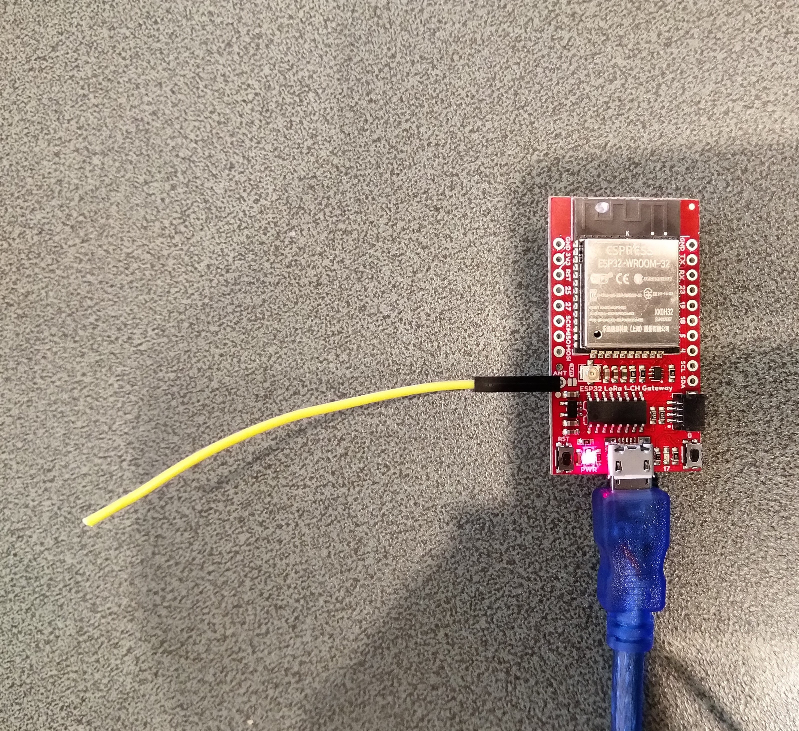

# RFM9XLoRa-NetNF
A C# library for LoRa[@LoRaAlliance](https://lora-alliance.org/) connectivity for Semtech [@SX127X](https://www.semtech.com/products/wireless-rf/lora-transceivers/SX1276)/HopeRF [@RFM9X](http://www.hoperf.com/rf_transceiver/lora/RFM95W.html) equipped .Net Nano framework powered devices.

The repo has the source code for the series of blog posts written as I built this library

01. ShieldSPI (https://blog.devmobile.co.nz/2020/04/10/nanoframework-lora-library-part1/)
02. RegisterScan(https://blog.devmobile.co.nz/2020/04/11/nanoframework-lora-library-part2/)
03. RegisterReadAndWrite(https://blog.devmobile.co.nz/2020/04/13/nanoframework-lora-library-part3/)
04. TransmitBasic(https://blog.devmobile.co.nz/2020/04/25/nanoframework-lora-library-part4a/)
05. ReceiveBasic(https://blog.devmobile.co.nz/2020/05/05/nanoframework-lora-library-part5/)
06. ReceiveTransmitInterrupt(https://blog.devmobile.co.nz/2020/05/06/nanoframwork-lora-library-part6/)

Currently (May2020) the Chibios(http://chibios.org/dokuwiki/doku.php) SPI library appears to be having some issues writing to the transmit FIFO. There is an additional unprintable byte at the start of the messages and the last byte is truncated.

20:56:48.545 -> Message: ⸮Hello from LoRaIoT1 ! 17 
20:56:48.578 -> Length: 25 
20:56:48.578 -> FirstChar: 143 
20:56:48.611 -> RSSI: -37 
20:56:48.611 -> Snr: 9.75 
20:56:48.611 -> 

Fully featured driver and sample application
Rfm9xLoRaDeviceClient 
Rfm9XLoRaDevice

There are also a parallel development projects for [.Net](https://github.com/KiwiBryn/RFM9XLoRa-Net), [NetMF](https://github.com/KiwiBryn/RFM9XLoRa-NetMF) and [GHI ELectronicss](https://ghielectronics.com/) [TinyCLR](https://github.com/KiwiBryn/RFM9XLoRa-TinyCLR)

My initial test rig consisted of
* [STM32F429 Discovery](https://www.st.com/en/evaluation-tools/32f429idiscovery.html) from [ST Micro electronics](https://www.st.com)
* [Dragino Shield](http://www.dragino.com/products/lora/item/102-lora-shield.html) from [Dragino Technology](http://www.dragino.com)
* [Armronix IA005: SX1276 Lora node](https://www.tindie.com/products/Armtronix/ia005-sx1276-lora-node-stm32f103-pair-2nos/) from Armtronix

My second test rig consisted of
* [LoRa Gateway - 1-Channel (ESP32)](https://www.sparkfun.com/products/15006)

